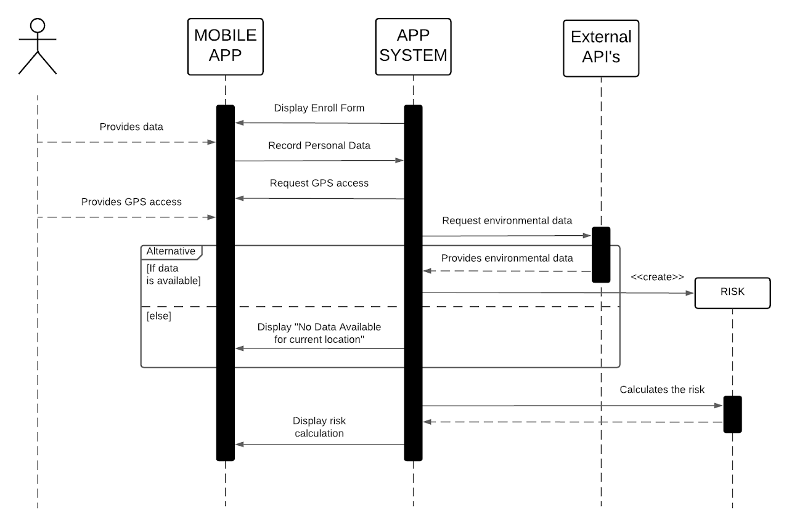
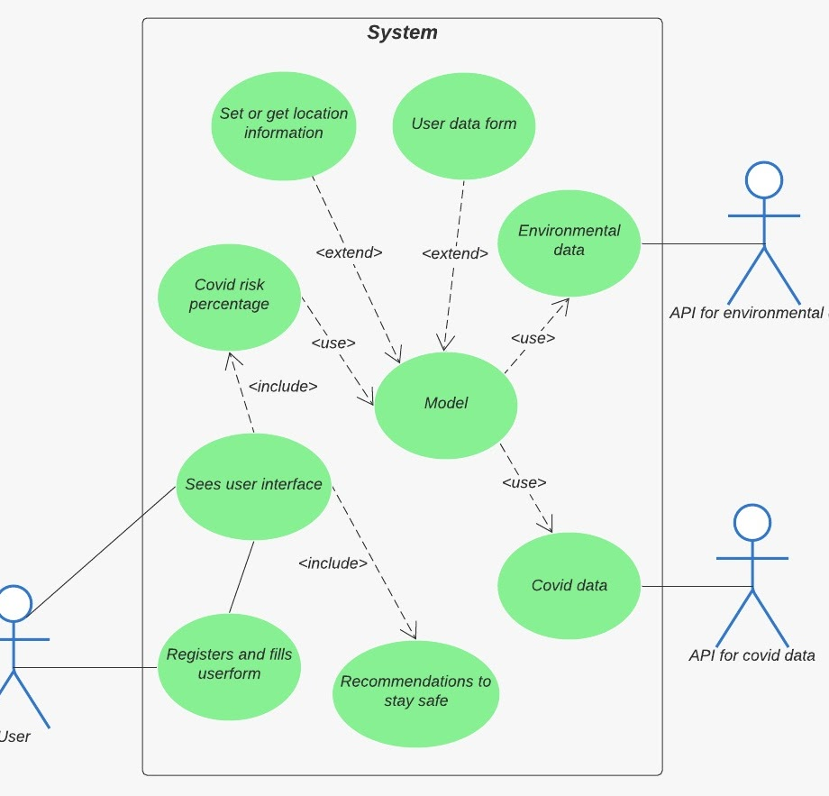

# COVID TRACKER

### By: Eating the frog

## Sumary
Multiplatform app to calculate the risk of getting COVID19 using a novel model
The model can be found in [model](https://github.com/morphisjustfun/NASA_CHALLENGE_UTILS)

## Resources
- React native
- Typescript

## Insights
- Good development practices using interfaces and modularity
- Use of modern libraries and data-fetching frameworks

## Utils




## To install libraries and run project

Make sure you have latest Android SDK and ADB correctly installed. Use a virtual device or a physical one

```console
foo@bar:~$ npm install
foo@bar:~$ npx react-native start
foo@bar:~$ npx react-native run-android
```

